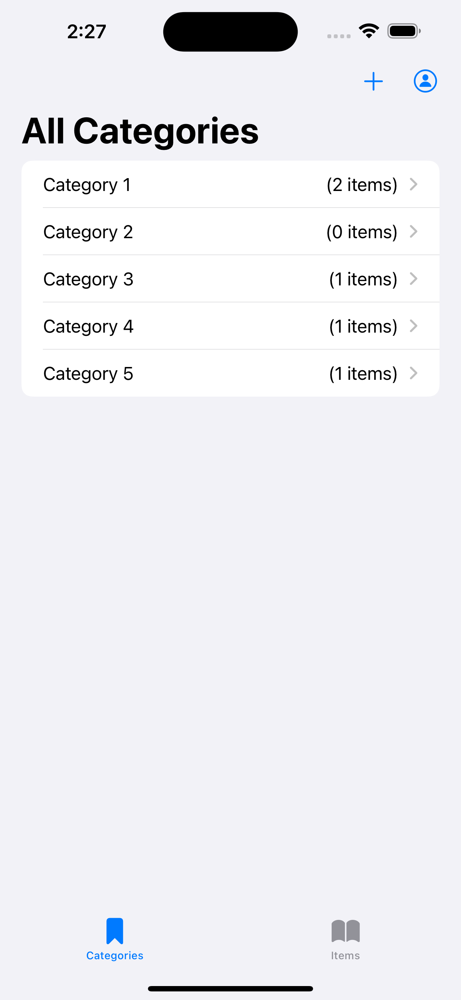
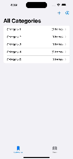

# CoreData-State-Management
An example SwiftUI project using CoreData to manage object data over time

 

  &nbsp;&nbsp;&nbsp;&nbsp;&nbsp;
&nbsp;&nbsp;&nbsp;&nbsp;&nbsp;
  &nbsp;&nbsp;&nbsp;&nbsp;&nbsp;
  &nbsp;&nbsp;&nbsp;&nbsp;&nbsp;

  

<!-- <video src="PreviewResources/ScreenRecording1.mp4" width="230"  title="Editing Category">&nbsp;&nbsp;&nbsp;&nbsp;&nbsp; -->

<!-- <video src="PreviewResources/ScreenRecording1.mp4" width="230" title="App Example"> -->

<!-- <video src="PreviewResources/ScreenRecording1.mp4"> -->

<!--  

  &nbsp;&nbsp;&nbsp;&nbsp;&nbsp;
&nbsp;&nbsp;&nbsp;&nbsp;&nbsp;
  &nbsp;&nbsp;&nbsp;&nbsp;&nbsp;

   -->