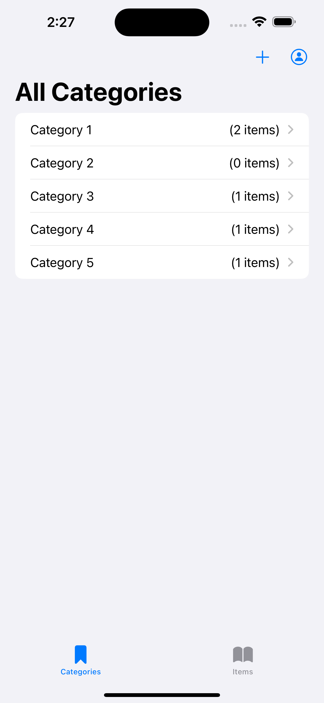
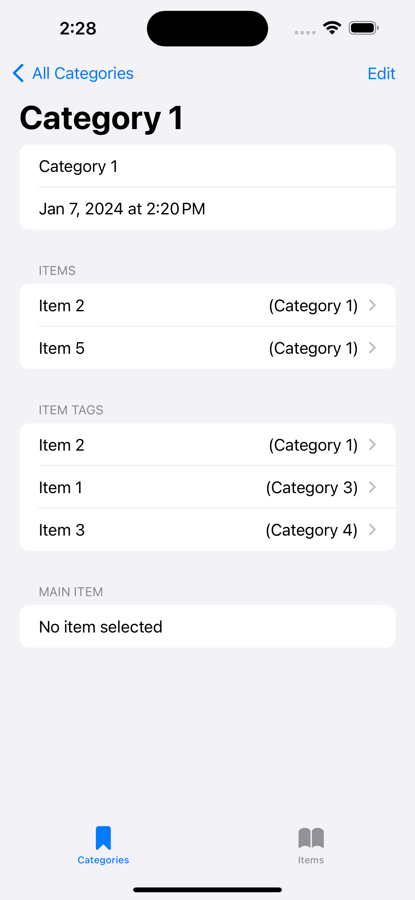
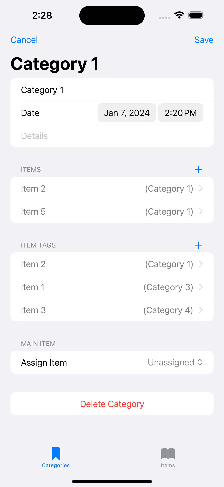

# CoreData State Management Framework

<section align="center">
  
  &nbsp;&nbsp;&nbsp;&nbsp;&nbsp;
  
  &nbsp;&nbsp;&nbsp;&nbsp;&nbsp;

</section>

### Overview:
An example **SwiftUI** project showcasing a <ins>*custom framework*</ins> implementing **CoreData** to manage dynamic object data over time.

### Use Case:

This project serves as a clear demonstration of the extensive versatility and wide-ranging applicability of my **CoreData** infrastructure framework.

Consisting of mainly generic code, designed to be reusable across numerous contexts, it requires minimal modification or changes before being a fully operational and adaptable solution for managing object state within applications.

Its robust architecture and modular design ensure scalability and seamless integration, keeping it suitable for a myriad of applications across various domains and making it an invaluable asset for any development team.

This optimised code streamlines and refines **CoreData** implementation, reducing the need for extensive customisation and thus allowing developers to concentrate on the core functionality of their projects.

    
Contents:

    <ul class="overview-section">
        <li><h3><a href="#future-plans">Future Plans</a></h3></li>
        <li><h3><a href="#current-difficulties">Current Difficulties</a></h3></li>
        <li><h3><a href="#past-problems">Past Problems</a></h3></li>
        <li><h3><a href="#screenshots">Screenshots</a></h3></li>
        <li><h3><a href="#licensing">Licensing</a></h3></li>
    </ul>

&nbsp;

# Project Progression

## Future Plans:

#### - <ins>Develop into Framework</ins>

Code is not setup as an actual *Framework* and so implementation isn't as streamlined as it could be. Lots of code that doesn't need to be seen is accessible and is taking up project namespace. Would be good to formulate code into something that is easier to implement with simple class inheritance etc. 

#### - <ins>Code Modularisation</ins>

I would like to export this code into custom Xcode file templates. This will make managing the project much easier and allow for the easy importing of relevant sections. Currently it can be quite difficult to import the whole structure and can be time consuming to work through and delete the sections that aren't needed.

#### - <ins>Complete Code Tidy Up</ins>

The code is comprehensive and well written, however after some time away it would be useful to re-look at it and determine whether each element is needed or whether it can be combined or reduced. This will make managing the project significantly easier.

## Current Difficulties:

#### - <ins>Project Size</ins>

Currently there is a significant amount of code carrying out a range of functionality throughout the application. Some elements have been written upon the realisation of a new context or app requirement, meaning that although they are integrated within the overall framework, they can sometimes seem like more of an add-on than part of a concise unit. As the project as developed certain elements have often been rewritten to accommodate to the new use case, this has left some parts feeling less succinct than they would ideally be. Rethinking overall concepts would help to streamline code, removing unnecessary duplications and tidying up large sections that were written successively but could instead be written as a complete unified whole.

## Past Problems:

#### - <ins>Entity Cardinality</ins>

Managing one-to-many and many-to-many object relationships caused extreme difficulty in a number of contexts.

#### - <ins>Dynamic Object Generation</ins>

This project is capable of generating a specified number of example objects of any entity type and creating various cardinal relationships between them.

#### - <ins>Generic Object Relationship Linking</ins>

#### - <ins>SwiftUI Previewing</ins>

**CoreDataPreviewManager** is a highly capable solution to previewing **SwiftUI** code that uses CoreData as its data structure. Using clear declarative syntax, **CoreDataPreviewManager** uses static fetch requests combined with a preview **NSPersistentContainer** to dynamically generate **CoreData** objects that are capable of being altered over time throughout view hierarchies.

#### - <ins>Protocol Conformance</ins>

This project uses several *protocols* to leverage the capability of *generic* code throughout the application. 

#### - <ins>Entity Codable Conformance & JSON Parsing</ins>

Having **CoreData** objects that can easily and simply be parsed to *JSON* ensures data can be shared across a range of applications. Through simple and uniform customisation, any *Entity* can now conform to the **Codable** protocol. An intuitive UI has also been included to allow users access to data generated over an app's life. Although primarily for developers during testing phases, this also grants full control to users of their data, giving it to them in an universal format and enabling them to take it wherever they wish.

#### - <ins>NSManagedObjectContext Child Contexts</ins>

#### - <ins>Generic One-to-Many & Many-to-Many View Sections</ins>

#### - <ins>Generic Add Object Views</ins>

#### - <ins>Generic All Objects & Object Detail Views</ins>

# Screenshots

<section align="center">

&nbsp;&nbsp;&nbsp;&nbsp;&nbsp;

&nbsp;&nbsp;&nbsp;&nbsp;&nbsp;
  
  &nbsp;&nbsp;&nbsp;&nbsp;&nbsp;
</section>
 

### Licensing

There is [no license](https://choosealicense.com/no-permission/) associated with this project other than usual GitHub [Terms of Service](https://docs.github.com/en/site-policy/github-terms/github-terms-of-service), however, please be mindful and acknowledge me as the original author if you use significant or distinct portions of this code.
